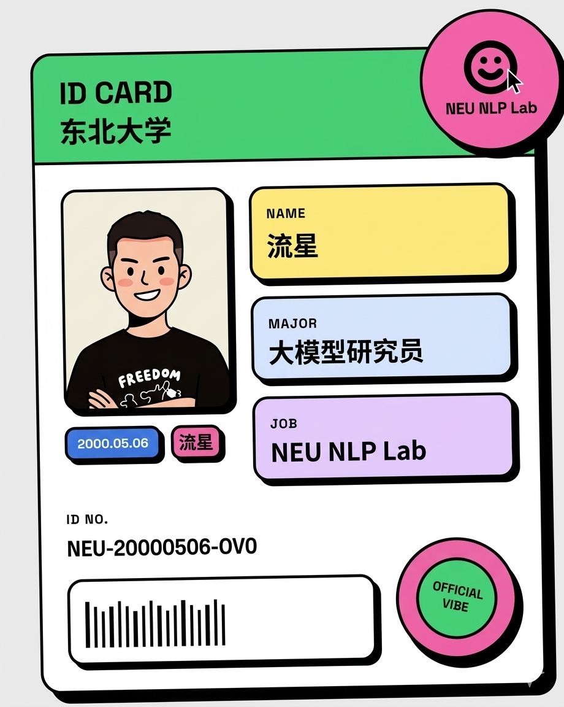
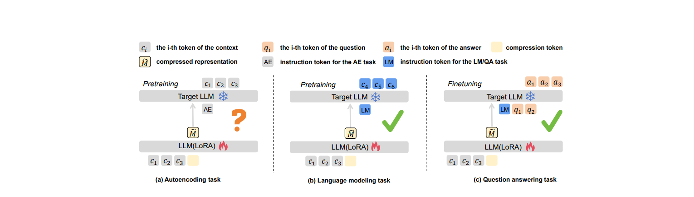
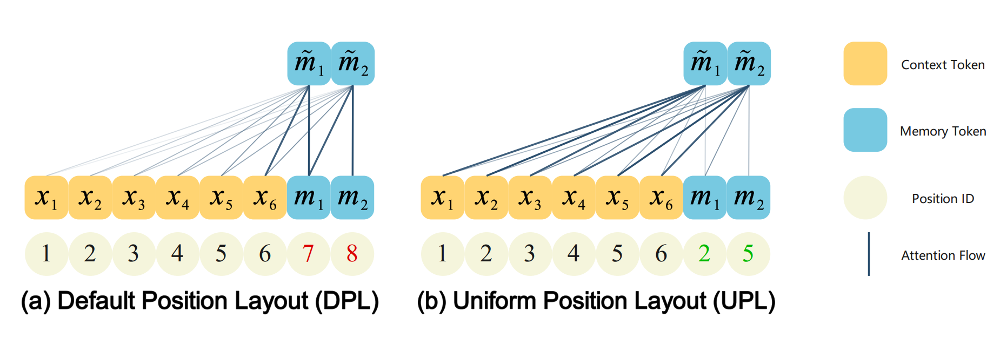

# 流星 Meteor 个人网站

一个以 Neo-Brutalist 风格为核心的个人主页，聚焦 AI 学习、研究作品、公众号文章与个人成长轨迹展示。

欢迎来访~：https://lx-meteors.github.io/

## 页面预览

   

   
   

   
   

## 项目亮点

- 强风格视觉：高对比配色、粗边框、硬阴影，突出 Neo-Brutalist 设计语言
- 单页多分区：首页 / 关于我 / 文章 / 作品集，支持无刷新切换
- 动效体验：使用 Motion 实现页面切换和卡片入场动画
- 学术展示：内置论文成果卡片与外链跳转
- 内容矩阵：公众号文章、个人历程、技能与联系方式一体化呈现

## 技术栈

- React 19
- TypeScript
- Vite 6
- Tailwind CSS 4
- Motion
- Lucide React

## 本地运行

前置要求：

- Node.js 18+

安装依赖：

npm install

启动开发环境：

npm run dev

默认访问地址：

http://localhost:3000

## 构建与预览

构建生产版本：

npm run build

本地预览构建结果：

npm run preview

## 项目结构

- src/App.tsx：主页面结构与模块内容
- src/index.css：全局样式与 Neo-Brutalist 主题变量
- public/img：站点图片资源（人物图、论文图、二维码等）
- metadata.json：项目元信息
- vite.config.ts：Vite 配置

## 可自定义内容

- 个人信息与经历：在 src/App.tsx 中的 About、Hero、Footer 区块修改
- 文章列表：在 App.tsx 的 ARTICLES 数组中维护
- 作品列表：在 App.tsx 的 PROJECTS 数组中维护
- 主题风格：在 src/index.css 中调整颜色变量与组件样式

## 部署建议

- 静态托管平台：Vercel、Netlify、GitHub Pages 均可
- 如使用 GitHub Pages，请确保仓库配置正确的 base 路径
- public 目录下资源可通过 /img/xxx 方式在前端引用

## 致谢

这个网站是个人学习与成长的长期展示窗口。

如果你对 AI 大模型、NLP、上下文压缩或个人技术成长话题感兴趣，欢迎交流。
